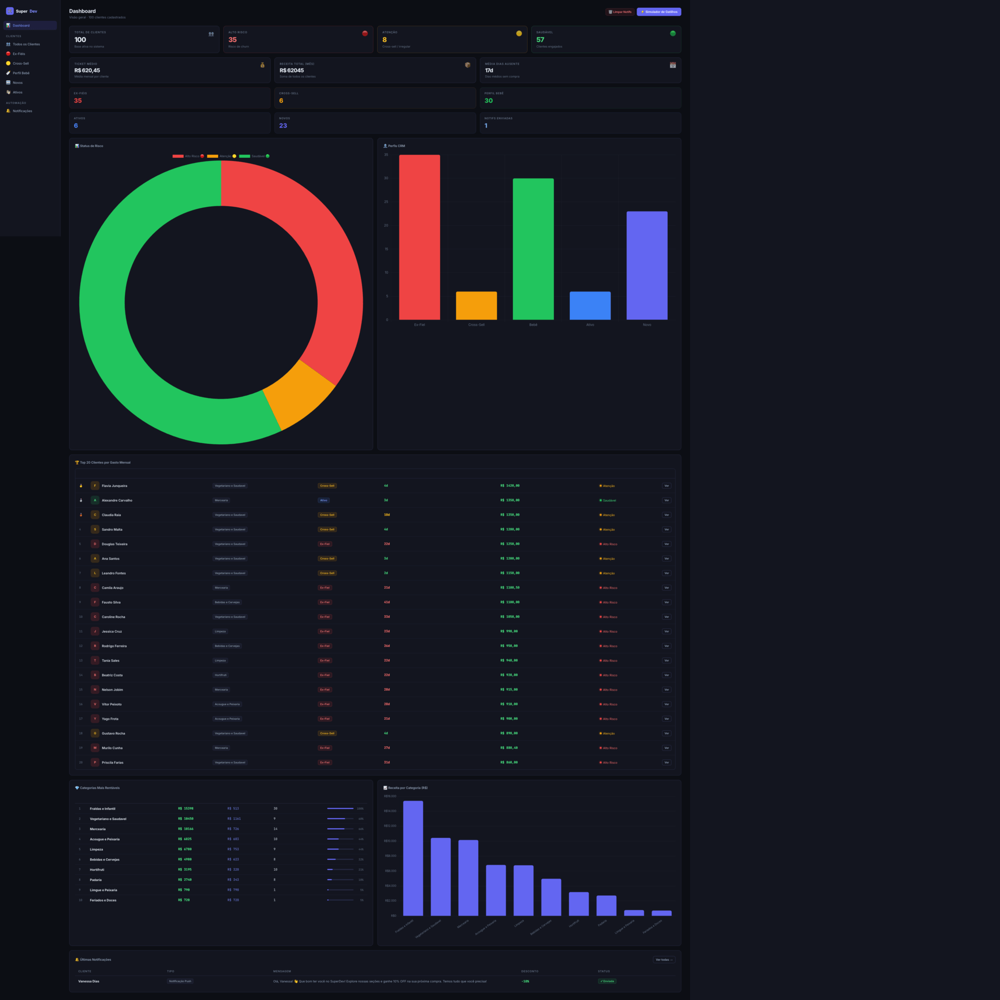
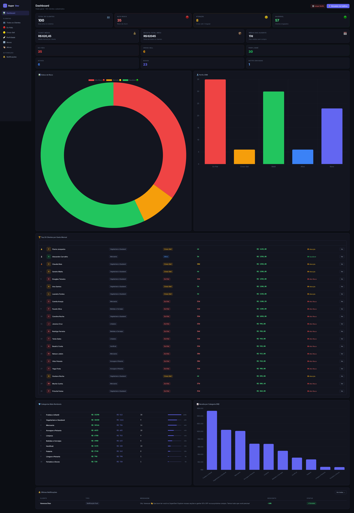
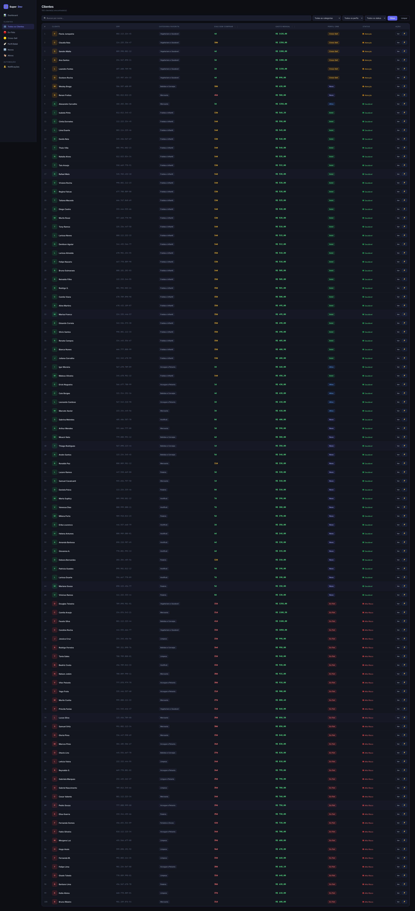
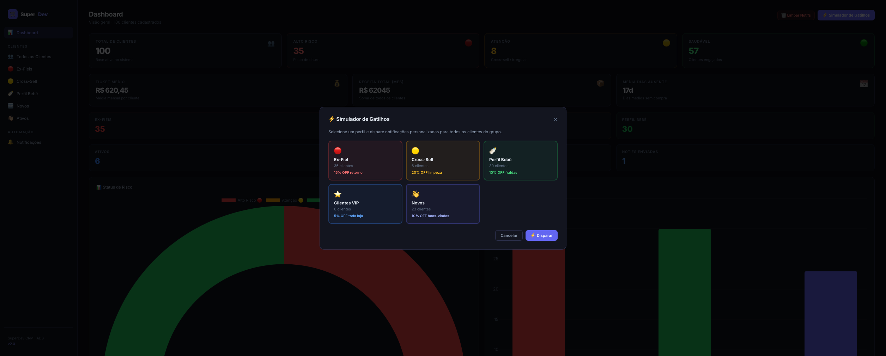
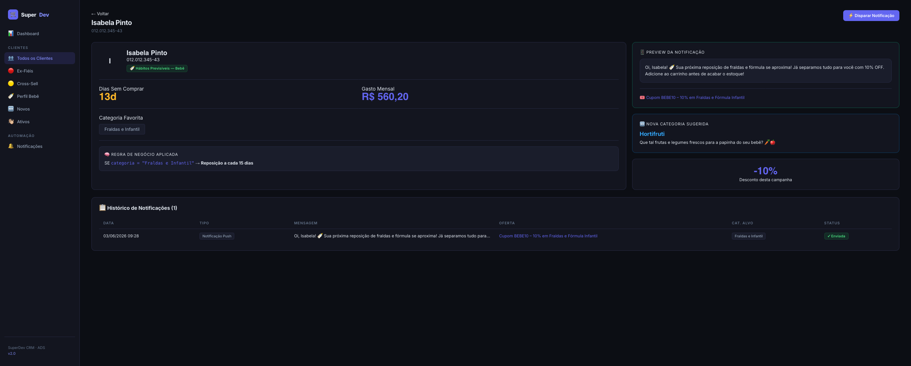
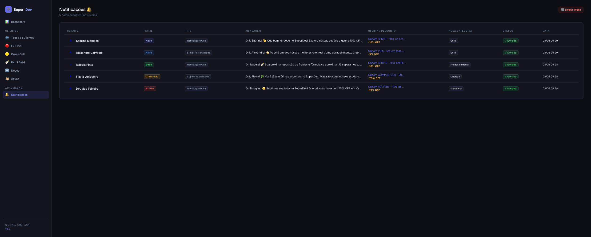

# 🛒 SuperDev CRM — Sistema de CRM Preditivo

> Projeto desenvolvido para a disciplina de **Gestão de Tecnologia da Informação**  
> Curso de Análise e Desenvolvimento de Sistemas

---



---

## 📋 Sobre o Projeto

O **SuperDev CRM** é um sistema fullstack de CRM (Customer Relationship Management) desenvolvido para a rede de supermercados fictícia **SuperDev**. O sistema analisa o histórico de compras de 100 clientes e dispara automaticamente ofertas e alertas personalizados com base no comportamento de cada perfil.

O projeto simula um módulo real de automação de marketing, onde a equipe de TI entrega ao Diretor de Marketing uma ferramenta capaz de identificar clientes em risco, oportunidades de venda cruzada e padrões de reposição.

---

## 🖥️ Telas do Sistema

### Dashboard Principal

> Visão geral com KPIs, gráficos de perfis, status de risco, categorias mais rentáveis e top 20 clientes.

### Lista de Clientes (Data Grid)

> Tabela ordenável por dias sem comprar e gasto mensal, com filtros por categoria, perfil e status.

### Simulador de Gatilhos

> Disparo em massa de notificações personalizadas por perfil de cliente.

### Detalhe do Cliente

> Ficha completa com regra de negócio aplicada, preview da notificação e histórico de disparos.

### Notificações

> Histórico completo de todas as campanhas disparadas.

---

## 🧠 Regras de Negócio (Lógica CRM)

O sistema classifica cada cliente automaticamente ao ser cadastrado, aplicando a seguinte lógica condicional:

| Perfil | Gatilho `SE` | Ação `ENTÃO` | Desconto |
|--------|-------------|--------------|:--------:|
| 🔴 **Ex-Fiel** | `gasto_mes ≥ R$600` **E** `dias_sem_comprar ≥ 20` | Push: *"Sentimos sua falta! Volte com desconto"* | 15% |
| 🟡 **Vegetariano Incompleto** | `categoria = "Vegetariano e Saudavel"` | Cupom: 20% OFF em Limpeza e Mercearia | 20% |
| 🍼 **Hábitos Previsíveis** | `categoria = "Fraldas e Infantil"` | Push: alerta de reposição a cada 15 dias | 10% |
| ⭐ **Cliente Ativo** | `dias_sem_comprar ≤ 7` **E** `gasto ≥ R$400` | E-mail VIP: 5% OFF em toda a loja | 5% |
| 👋 **Novo/Irregular** | Demais casos | Push de boas-vindas e engajamento | 10% |

### Semáforo de Risco

```
🔴 VERMELHO → Ex-Fiel: cliente valioso que sumiu (alto risco de churn)
🟡 AMARELO  → Vegetariano Incompleto ou padrão irregular (atenção)
🟢 VERDE    → Perfil Bebê, Ativo ou Novo recente (saudável)
```

---

## ⚙️ Tecnologias Utilizadas

| Camada | Tecnologia |
|--------|-----------|
| Backend | Python 3 + Django 5 |
| Banco de dados | SQLite3 |
| Frontend | HTML5 + CSS3 + JavaScript (vanilla) |
| Gráficos | Chart.js 4 |
| Fonte | Inter + JetBrains Mono (Google Fonts) |

---

## 🚀 Como Rodar o Projeto

### Pré-requisitos
- Python 3.10 ou superior
- pip

### Passo a passo

```bash
# 1. Crie e ative o ambiente virtual
python -m venv venv

# Windows
venv\Scripts\activate

# Mac/Linux
source venv/bin/activate

# 2. Instale o Django
pip install django

# 3. Entre na pasta do projeto
cd superdev_crm

# 4. Aplique as migrações
python manage.py migrate

# 5. Popule o banco com os 100 clientes
python manage.py popular_dados

# 6. Inicie o servidor
python manage.py runserver
```

Acesse **http://127.0.0.1:8000** no navegador.

> 💡 O arquivo `db.sqlite3` já vem populado no repositório. Você pode pular os passos 4 e 5 e ir direto ao `runserver`.

---

## 📁 Estrutura do Projeto

```
superdev_crm/
│
├── crm/
│   ├── models.py                        # Modelos: Cliente e Notificacao
│   ├── views.py                         # Lógica de negócio e endpoints da API
│   ├── urls.py                          # Rotas da aplicação
│   ├── templates/
│   │   └── crm/
│   │       ├── base.html                # Layout base (sidebar, navbar, toasts)
│   │       ├── dashboard.html           # Dashboard com KPIs e gráficos
│   │       ├── lista_clientes.html      # Data grid com filtros
│   │       ├── detalhe_cliente.html     # Ficha individual do cliente
│   │       └── notificacoes.html        # Histórico de notificações
│   └── management/
│       └── commands/
│           └── popular_dados.py         # Carga inicial dos 100 clientes
│
├── superdev_crm/
│   ├── settings.py
│   └── urls.py
│
├── db.sqlite3                           # Banco já populado
└── README.md
```

---

## 🔌 API Endpoints

| Método | Endpoint | Descrição |
|--------|----------|-----------|
| `POST` | `/api/disparar-perfil/` | Dispara notificações para todos os clientes de um perfil |
| `POST` | `/api/disparar-cliente/<id>/` | Dispara notificação individual |
| `POST` | `/api/limpar-notificacoes/` | Remove todas as notificações |

### Exemplo de requisição

```json
POST /api/disparar-perfil/
Content-Type: application/json

{ "perfil": "ex_fiel" }
```

### Exemplo de resposta

```json
{
  "sucesso": true,
  "total_disparado": 35,
  "notificacoes": [
    {
      "cliente": "Lucas Silva",
      "mensagem": "Oi, Lucas! 😢 Sentimos sua falta no SuperDev! ...",
      "oferta": "Cupom VOLTEI15 – 15% de desconto em Mercearia",
      "desconto": 15,
      "nova_categoria": "Padaria",
      "sugestao": "Aproveite e conheça nossa Padaria Artesanal! 🍞"
    }
  ]
}
```

---

## 📄 Licença

Projeto acadêmico desenvolvido para fins educacionais — **ADS · Gestão de TI**
